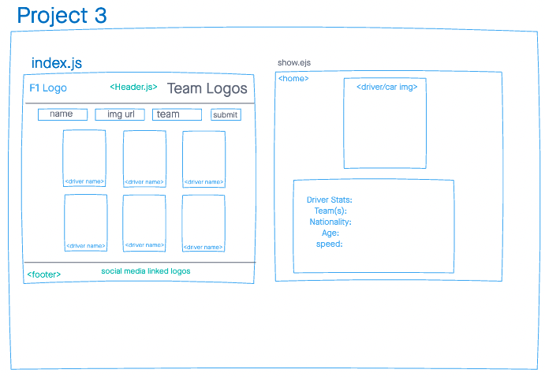

# Hello and Welcome to my App!

For this app, I based it on Formula 1 Racing. The app is a working full-stack, single-page application hosted on both Heroku and Netlify. The user will be able to create, edit, update or delete (Full CRUD data operations) an existing driver on the home page. 

# Technologies used: 
- MongoDB/Mongoose 
- Express
- React 
- Node 

# Screenshots: 

# Screenshots of deployed App: 

# Get Started: 

# Future Enchancements: 

For future enhancements, I want to make the app not only look more modern but add more functions and features such as giving the users options the list of the 2021 cars along with the stats of top speed, control, etc. they could pick from, and have that car attached to the bottom of what ever image of a driver they pick from.